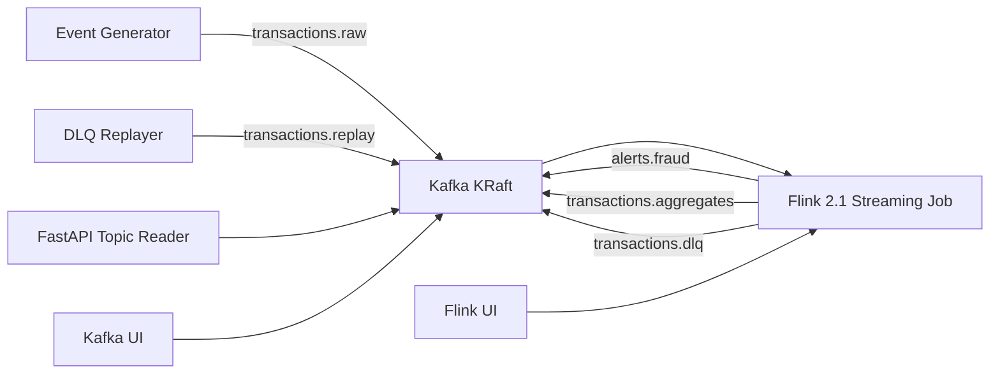

# Flink Kafka(KRaft) Realtime Lab

Kafka KRaft와 Apache Flink로 실시간 집계, 알람 판단, DLQ, replay, late event 처리를 학습하고 실무 설계에 참고할 수 있는 스트리밍 랩입니다.

이 프로젝트는 ML fraud score가 포함된 결제 이벤트를 Kafka로 수집하고, Flink가 event-time 기준으로 사용자/가맹점/국가별 실시간 판단을 수행한 뒤 Kafka topic으로 결과를 발행합니다.

## Version Baseline

| Component | Version | Why |
| --- | --- | --- |
| Kafka | `apache/kafka:4.1.2` | KRaft-only 전환 이후 안정화된 4.1 patch line |
| Flink | `2.1.2` | 신규 학습/신규 구축에 적합한 2.x line |
| Flink Kafka connector | `4.0.1-2.0` | Flink 2.x connector line |
| Java | `17` | Flink 2.x 실무 기본값으로 적합 |

## Architecture



## Core Scenarios

- `HIGH_RISK_TRANSACTION`: 단건 ML score, 금액, IP risk 기반 fraud alert
- `USER_PAYMENT_BURST`: 사용자별 1분 window burst alert
- `MERCHANT_ANOMALY`: 가맹점별 1분 거래량/금액/평균 위험도 alert
- `COUNTRY_CATEGORY_1M`: 국가/카테고리/가맹점 기준 1분 실시간 집계
- `transactions.dlq`: 파싱 실패, 검증 실패, late event 격리
- `transactions.replay`: DLQ 보정 후 재처리 topic

## Start Here

- [Project Structure](docs/project-structure.md): 전체 구성, 서비스 역할, topic/data flow, Docker/K8s 구조
- [How To Run](docs/how-to-run.md): Docker Compose와 Kubernetes 실행 방법
- [Test Scenarios](docs/test-scenarios.md): 알람, 집계, DLQ, replay, late event 실험 방법

## Quick Start: Docker Compose

Prerequisite: Docker Desktop or OrbStack must be running.

```bash
make build
make up
make produce
make smoke
```

Useful commands:

```bash
make topics
make lag
make consume-alerts
make consume-aggregates
make consume-dlq
make replay-dlq
make consume-replay
```

Dashboards:

- Flink UI: http://localhost:8081
- Kafka UI: http://localhost:8080
- FastAPI docs: http://localhost:8000/docs

## Kubernetes

Kubernetes manifests are provided under `k8s/` with Strimzi Kafka and Flink Kubernetes Operator CRs.

```bash
kubectl kustomize k8s/overlays/dev
kubectl kustomize k8s/overlays/prod-like
```

See [Kubernetes guide](docs/kubernetes-guide.md) for operator prerequisites, image naming, and deployment order.

## Learning Path

1. Run Docker Compose and inspect Kafka topics.
2. Read [schema.md](docs/schema.md) to understand event contracts.
3. Change fraud thresholds in `RiskRules` and run tests.
4. Compare raw, aggregate, alert, DLQ, and replay topics.
5. Read [operations-runbook.md](docs/operations-runbook.md) and map each check to a real production concern.
6. Render the Kubernetes overlays and compare dev vs prod-like choices.

## Repository Layout

```text
.
├── api/             # FastAPI topic reader
├── docs/            # guides, schemas, runbooks, review cycles
├── flink-job/       # Java Flink DataStream job
├── generator/       # synthetic transaction producer
├── k8s/             # Strimzi + Flink Operator manifests
├── replayer/        # DLQ to replay topic helper
├── scripts/         # topic and smoke-test helpers
└── docker-compose.yml
```

## Test

```bash
make test
docker compose config
python3 -m py_compile api/src/main.py generator/src/producer.py replayer/src/replay_dlq.py
kubectl kustomize k8s/overlays/dev
kubectl kustomize k8s/overlays/prod-like
```

## Production Notes

This is a runnable lab, not a copy-paste production platform. For production, replace local checkpoint storage, add authentication/TLS, use durable Kafka/Flink storage, define SLO alerts, and connect schema governance. The project intentionally documents those gaps so learners can see how the local lab maps to real systems.
