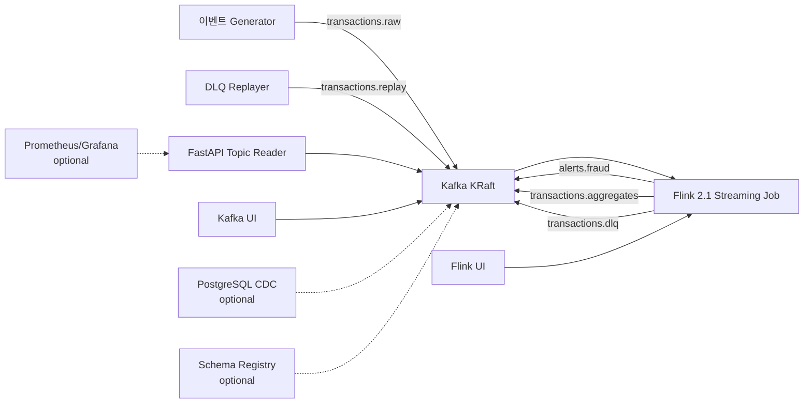

# Flink Kafka(KRaft) 실시간 스트리밍 랩

Kafka KRaft와 Apache Flink로 실시간 집계, 알람 판단, DLQ, replay, late event 처리를 학습하고 실무 설계에 참고할 수 있는 스트리밍 랩입니다.

이 프로젝트는 ML fraud score가 포함된 결제 이벤트를 Kafka로 수집하고, Flink가 event-time 기준으로 사용자/가맹점/국가별 실시간 판단을 수행한 뒤 Kafka topic으로 결과를 발행합니다.

기본 실행은 가볍게 유지하고, Schema Registry, CDC, Grafana 관측성, 장애 복구 실습, Flink SQL 예제는 선택 profile과 별도 문서로 제공합니다.

## 버전 기준

| 구성 요소 | 버전 | 선택 이유 |
| --- | --- | --- |
| Kafka | `apache/kafka:4.1.2` | KRaft-only 전환 이후 안정화된 4.1 patch 계열 |
| Flink | `2.1.2` | 신규 학습/신규 구축에 적합한 2.x 계열 |
| Flink Kafka connector | `4.0.1-2.0` | Flink 2.x connector 계열 |
| Java | `17` | Flink 2.x 실무 기본값으로 적합 |

## 아키텍처



## 핵심 시나리오

- `HIGH_RISK_TRANSACTION`: 단건 ML score, 금액, IP risk 기반 fraud 알람
- `USER_PAYMENT_BURST`: 사용자별 1분 window burst 알람
- `MERCHANT_ANOMALY`: 가맹점별 1분 거래량/금액/평균 위험도 알람
- `COUNTRY_CATEGORY_1M`: 국가/카테고리/가맹점 기준 1분 실시간 집계
- `transactions.dlq`: 파싱 실패, 검증 실패, late event 격리
- `transactions.replay`: DLQ 보정 후 재처리 topic
- `merchant_risk_profiles`: PostgreSQL CDC 기반 reference data topic
- Schema Registry: Avro schema contract와 evolution 학습
- Observability: topic message count, DLQ, alert, consumer lag 관측
- Failure recovery: TaskManager 장애, Kafka 재시작, savepoint 실습
- Flink SQL: 동일 집계 요구사항을 SQL로 표현한 비교 예제

## 먼저 읽기

- [프로젝트 구성](docs/project-structure.md): 전체 구성, 서비스 역할, topic/data flow, Docker/K8s 구조
- [실행 방법](docs/how-to-run.md): Docker Compose와 Kubernetes 실행 방법
- [테스트 시나리오](docs/test-scenarios.md): 알람, 집계, DLQ, replay, late event 실험 방법
- [Schema Registry 가이드](docs/schema-registry-guide.md): Avro schema contract와 evolution
- [관측성 가이드](docs/observability-guide.md): Prometheus/Grafana와 운영 metric
- [장애와 복구 실습](docs/failure-recovery-guide.md): TaskManager/Kafka 장애, 부하, savepoint
- [CDC 가이드](docs/cdc-guide.md): PostgreSQL reference data를 Kafka topic으로 흘리는 예제
- [Flink SQL 가이드](docs/flink-sql-guide.md): DataStream API와 SQL 접근 비교

## 빠른 시작: Docker Compose

사전 조건: Docker Desktop 또는 OrbStack이 실행 중이어야 합니다.

```bash
make build
make up
make produce
make smoke
```

자주 쓰는 명령:

```bash
make topics
make lag
make consume-alerts
make consume-aggregates
make consume-dlq
make replay-dlq
make consume-replay
make observe-up
make schema-up
make schema-register
```

대시보드:

- Flink UI: http://localhost:8081
- Kafka UI: http://localhost:8080
- FastAPI docs: http://localhost:8000/docs
- Prometheus: http://localhost:9090
- Grafana: http://localhost:3000

## 선택 확장 실행

```bash
# Schema Registry에 Avro schema 등록
make schema-up
make schema-register

# Prometheus/Grafana 관측성
make observe-up

# PostgreSQL CDC + Debezium Kafka Connect
make cdc-up
make cdc-register
make cdc-update-merchant

# 장애/복구/부하 실습
make chaos-kill-taskmanager
make chaos-restart-kafka
make produce-high-load
make savepoint
```

## Kubernetes 실행

Kubernetes manifests는 `k8s/` 아래에 있으며 Strimzi Kafka와 Flink Kubernetes Operator CR을 사용합니다.

```bash
kubectl kustomize k8s/overlays/dev
kubectl kustomize k8s/overlays/prod-like
```

Operator 사전 조건, image naming, 배포 순서는 [Kubernetes 가이드](docs/kubernetes-guide.md)를 참고하세요.

## 학습 경로

1. Docker Compose로 실행한 뒤 Kafka topic을 확인합니다.
2. [schema.md](docs/schema.md)를 읽고 event contract를 이해합니다.
3. `RiskRules`의 fraud threshold를 바꾸고 test를 실행합니다.
4. raw, aggregate, alert, DLQ, replay topic을 비교합니다.
5. [operations-runbook.md](docs/operations-runbook.md)를 읽고 각 점검 항목이 실제 운영에서 어떤 의미인지 연결합니다.
6. Kubernetes overlay를 render해서 dev와 prod-like 설정 차이를 비교합니다.

## 저장소 구조

```text
.
├── api/             # FastAPI topic reader
├── docs/            # 가이드, 스키마, runbook, review cycle 문서
├── cdc/             # PostgreSQL CDC와 Debezium connector 예제
├── flink-job/       # Java Flink DataStream job
├── flink-sql/       # Flink SQL 집계 예제
├── generator/       # synthetic transaction producer
├── k8s/             # Strimzi + Flink Operator manifests
├── observability/   # Prometheus/Grafana starter dashboard
├── replayer/        # DLQ to replay topic helper
├── schemas/         # Avro schema contract 예제
├── scripts/         # topic 생성과 smoke test helper
└── docker-compose.yml
```

## 테스트

```bash
make test
docker compose config
python3 -m py_compile api/src/main.py generator/src/producer.py replayer/src/replay_dlq.py
kubectl kustomize k8s/overlays/dev
kubectl kustomize k8s/overlays/prod-like
```

## 운영 적용 시 주의점

이 저장소는 실행 가능한 lab이지만 그대로 복사해 production platform으로 쓰기 위한 완성본은 아닙니다. 운영에서는 local checkpoint storage를 durable storage로 바꾸고, authentication/TLS, Kafka/Flink durable storage, SLO 알람, schema governance를 추가해야 합니다. 이 프로젝트는 local lab이 실제 시스템으로 확장될 때 무엇이 달라져야 하는지 학습할 수 있도록 그 차이를 명시합니다.
