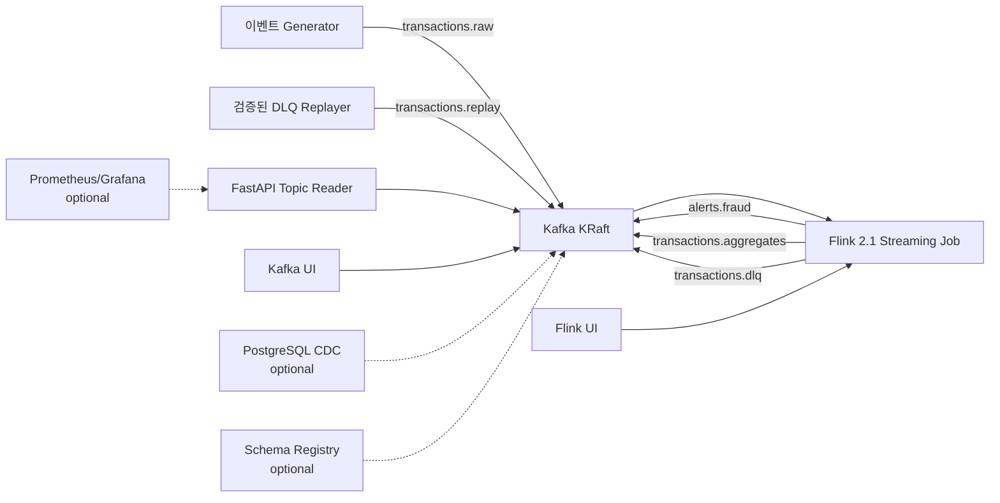

# Flink·Kafka KRaft 실시간 이상 결제 탐지 랩

Kafka KRaft와 Apache Flink로 결제 이벤트를 처리하며 event time, 실시간 집계,
위험 알람, DLQ, 안전한 replay를 실험하는 프로젝트입니다.

이 프로젝트는 ML fraud score가 포함된 결제 이벤트를 Kafka로 수집하고, Flink가 event-time 기준으로 사용자/가맹점/국가별 실시간 판단을 수행한 뒤 Kafka topic으로 결과를 발행합니다.

기본 실행은 가볍게 유지하고, Schema Registry, CDC, Grafana 관측성, 장애 복구 실습, Flink SQL 예제는 선택 profile과 별도 문서로 제공합니다.

## 버전 기준

| 구성 요소 | 버전 | 선택 이유 |
| --- | --- | --- |
| Kafka | `apache/kafka:4.1.2` | KRaft-only 4.x 동작을 고정된 환경에서 재현 |
| Flink | `2.1.2` | Flink 2.x DataStream API와 runtime 사용 |
| Flink Kafka connector | `4.0.1-2.0` | Flink 2.x connector 계열 |
| Java | `17` | build와 runtime 기준을 동일하게 고정 |

## 아키텍처


```mermaid
flowchart LR
    G["이벤트 Generator"] -->|transactions.raw| K["Kafka KRaft"]
    R["검증된 DLQ Replayer"] -->|transactions.replay| K
    K --> F["Flink 2.1 Streaming Job"]
    F -->|alerts.fraud| K
    F -->|transactions.aggregates| K
    F -->|transactions.dlq| K
    API["FastAPI Topic Reader"] --> K
    UI["Kafka UI"] --> K
    FU["Flink UI"] --> F
    PG["PostgreSQL CDC<br/>optional"] -.-> K
    SR["Schema Registry<br/>optional"] -.-> K
    OBS["Prometheus/Grafana<br/>optional"] -.-> API
```

## 핵심 시나리오

- `HIGH_RISK_TRANSACTION`: 단건 ML score, 금액, IP risk 기반 fraud 알람
- `USER_PAYMENT_BURST`: 사용자별 1분 window burst 알람
- `MERCHANT_ANOMALY`: 가맹점별 1분 거래량/금액/평균 위험도 알람
- `COUNTRY_CATEGORY_MERCHANT_1M`: 국가/카테고리/가맹점 기준 1분 실시간 집계
- `transactions.dlq`: 파싱 실패, 검증 실패, late event 격리
- `transactions.replay`: 안전성 검사를 통과한 DLQ 이벤트의 재처리 topic
- `merchant_risk_profiles`: PostgreSQL CDC 기반 가맹점 risk profile을 Flink Broadcast State로 join
- Schema Registry: Avro schema contract와 evolution 학습
- Observability: topic별 보존 레코드 추정치, DLQ, alert, consumer lag 관측
- Load/backpressure: 부하 증가, lag, Flink backpressure 관측
- Failure recovery: TaskManager 장애, Kafka 재시작, savepoint 실습
- Flink SQL: 동일 집계 요구사항을 SQL로 표현한 비교 예제

## 설계에서 해결한 문제

| 문제 | 적용한 설계 |
| --- | --- |
| 역직렬화 실패가 job 전체 장애로 번짐 | Kafka envelope를 보존한 뒤 Flink parser와 side output에서 DLQ 분리 |
| late/replay event의 출처를 추적하기 어려움 | source topic/partition/offset과 replay run metadata 보존 |
| 유휴 partition 때문에 watermark가 멈춤 | bounded out-of-orderness와 source idleness 설정 |
| CDC reference 변경과 삭제 반영 | compacted topic + Broadcast State + Debezium delete rewrite |
| 재처리 대상이 실행 시점에 바뀜 | preview에서 선택한 exact offset, 동일 run ID, 명시적 confirm 요구 |
| 장애 시 sink 중복 가능성 비교 | at-least-once와 Kafka transactional exactly-once 실행 경로 분리 |

## 먼저 읽기

- [프로젝트 구성](docs/project-structure.md): 전체 구성, 서비스 역할, topic/data flow, Docker/K8s 구조
- [실행 방법](docs/how-to-run.md): Docker Compose와 Kubernetes 실행 방법
- [테스트 시나리오](docs/test-scenarios.md): 알람, 집계, DLQ, replay, late event 실험 방법
- [Schema Registry 가이드](docs/schema-registry-guide.md): Avro schema contract와 evolution
- [관측성 가이드](docs/observability-guide.md): Prometheus/Grafana와 운영 metric
- [부하/백프레셔 실험](docs/load-backpressure-guide.md): high-load generator, lag, Flink backpressure 관측
- [장애와 복구 실습](docs/failure-recovery-guide.md): TaskManager/Kafka 장애, 부하, savepoint
- [CDC 가이드](docs/cdc-guide.md): PostgreSQL reference data를 Kafka topic으로 흘리고 Flink Broadcast State로 join하는 예제
- [CI E2E Smoke Test](docs/ci-e2e-smoke.md): GitHub Actions에서 Docker Compose로 핵심 경로를 검증하는 방법
- [Delivery Guarantee 실습](docs/delivery-guarantee-guide.md): At-least-once와 Exactly-once 실행 차이
- [DLQ Summary/Replay API 실습](docs/dlq-replay-api-guide.md): DLQ 원인 요약, replay 미리보기, API 기반 재처리
- [Flink SQL 가이드](docs/flink-sql-guide.md): DataStream API와 SQL 접근 비교

## 빠른 시작: Docker Compose

사전 조건: Docker Desktop 또는 OrbStack이 실행 중이어야 합니다.

공유 환경에서 비밀번호나 API token을 바꾸려면 `.env.example`을 복사해 `.env`를
만드십시오. 로컬 기본값만 사용할 때는 생략할 수 있습니다.
Compose의 host port는 로컬 머신(`127.0.0.1`)에만 바인딩됩니다.

```bash
make build
make up
make produce
make smoke
```

CI와 같은 E2E 검증을 로컬에서 실행하려면:

```bash
make ci-smoke
```

Exactly-once 모드를 비교하려면:

```bash
make up-exactly-once
make produce
make smoke
```

자주 쓰는 명령:

```bash
make topics
make lag
make consume-alerts
make consume-aggregates
make consume-dlq
make dlq-summary
make dlq-replay-preview
make dlq-replay-api
make replay-dlq
make consume-replay
make load-snapshot
make load-experiment-small
make observe-up
make schema-up
make schema-register
```

대시보드:

- Flink UI: http://localhost:8081
- Kafka UI: http://localhost:8080
- FastAPI docs: http://localhost:8000/docs
- Prometheus: http://localhost:9090
- Grafana: http://localhost:3000

## 선택 확장 실행

```bash
# Schema Registry에 Avro schema 등록
make schema-up
make schema-register

# Prometheus/Grafana 관측성
make observe-up

# PostgreSQL CDC + Debezium Kafka Connect
make cdc-up
make cdc-register
make cdc-update-merchant

# 장애/복구/부하 실습
make load-snapshot
make load-experiment-small
make chaos-kill-taskmanager
make chaos-restart-kafka
make produce-high-load
make savepoint
```

## Kubernetes 실행

Kubernetes manifests는 `k8s/` 아래에 있으며 Strimzi Kafka와 Flink Kubernetes Operator CR을 사용합니다.

```bash
kubectl kustomize k8s/overlays/dev
kubectl kustomize k8s/overlays/prod-like
kubectl kustomize k8s/overlays/exactly-once
```

Operator 사전 조건, image naming, 배포 순서는 [Kubernetes 가이드](docs/kubernetes-guide.md)를 참고하세요.

## 학습 경로

1. Docker Compose로 실행한 뒤 Kafka topic을 확인합니다.
2. [schema.md](docs/schema.md)를 읽고 event contract를 이해합니다.
3. `.env`의 `RISK_*` threshold를 바꾸고 서비스를 재시작해 결과를 비교합니다.
4. raw, aggregate, alert, DLQ, replay topic을 비교합니다.
5. `make cdc-up`, `make cdc-register`, `make cdc-update-merchant`로 reference data 변경이 알람 판단에 반영되는지 확인합니다.
6. [operations-runbook.md](docs/operations-runbook.md)를 읽고 각 점검 항목이 실제 운영에서 어떤 의미인지 연결합니다.
7. Kubernetes overlay를 render해서 dev와 prod-like 설정 차이를 비교합니다.

## 저장소 구조

```text
.
├── api/             # FastAPI topic reader와 DLQ replay API
├── cdc/             # PostgreSQL CDC와 Debezium connector 예제
├── common/          # API와 replayer가 공유하는 Python helper
├── docs/            # 가이드, 스키마, runbook, review cycle 문서
├── flink-job/       # Java Flink DataStream job
├── flink-sql/       # Flink SQL 집계 예제
├── generator/       # synthetic transaction producer
├── k8s/             # Strimzi + Flink Operator manifests
├── observability/   # Prometheus/Grafana starter dashboard
├── replayer/        # 검증된 DLQ event를 replay topic으로 발행하는 도구
├── schemas/         # Avro schema contract 예제
├── scripts/         # topic 생성, smoke test, 부하/백프레셔 관측 helper
└── docker-compose.yml
```

## 테스트

```bash
make test
make test-python
docker compose --profile tools --profile schema --profile cdc --profile observability config
make ci-smoke
make ci-smoke-exactly-once
python3 -m py_compile \
  api/src/main.py cdc/register_postgres_connector.py common/python/realtime_lab/dlq_tools.py \
  generator/src/producer.py replayer/src/replay_dlq.py scripts/*.py
kubectl kustomize k8s/overlays/dev
kubectl kustomize k8s/overlays/prod-like
kubectl kustomize k8s/overlays/exactly-once
```

## 운영 적용 시 주의점

이 저장소는 실행 가능한 학습·검증 환경이며 production platform 배포본은 아닙니다.
Compose의 Kafka data, PostgreSQL data, Flink checkpoint는 named volume에 남지만 단일
Docker host 장애를 견디지 못합니다.
실제 배포에서는 Kafka 인증/TLS와 고가용성, 원격 checkpoint storage, secret manager,
NetworkPolicy, schema compatibility gate, SLO와 alert routing을 별도로 설계해야 합니다.
