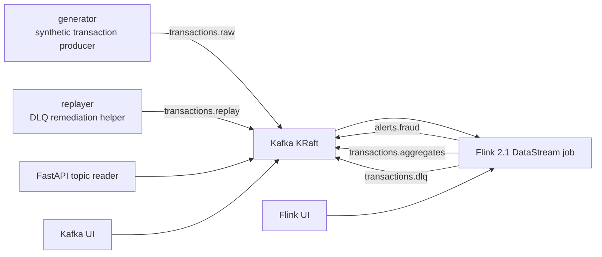

# Project Structure

이 문서는 이 저장소가 어떤 구성 요소로 이루어져 있고, 각 구성 요소가 스트리밍 파이프라인에서 어떤 책임을 갖는지 설명합니다.

## 한 줄 요약

이 프로젝트는 결제/ML fraud 이벤트를 Kafka KRaft로 수집하고, Flink 2.1이 event-time 기준으로 실시간 집계와 알람을 계산한 뒤 Kafka topic으로 결과를 내보내는 학습/실무 참고용 스트리밍 랩입니다.

## 전체 데이터 흐름



## 주요 컴포넌트

| Component | Path | Runtime | Responsibility |
| --- | --- | --- | --- |
| Kafka KRaft | `docker-compose.yml`, `k8s/base/kafka*.yaml` | Kafka 4.1.2 | 원천 이벤트, 알람, 집계, DLQ, replay topic 저장 |
| Flink Job | `flink-job/` | Flink 2.1.2, Java 17 | event-time 처리, window 집계, 알람 판단, DLQ 분기 |
| Generator | `generator/` | Python | 실험용 결제 이벤트 생성 |
| Replayer | `replayer/` | Python | DLQ 이벤트를 보정해 replay topic으로 재발행 |
| API | `api/` | FastAPI | Kafka topic 메시지 조회용 HTTP API |
| Docker Compose | `docker-compose.yml`, `Makefile` | Docker | 로컬 학습/검증 실행 환경 |
| Kubernetes | `k8s/` | Strimzi, Flink Operator | operator 기반 배포 참고 매니페스트 |
| Docs | `docs/` | Markdown | 학습, 실행, 운영, 스키마, 버전 결정 문서 |

## Kafka Topic 구성

| Topic | Producer | Consumer | Purpose |
| --- | --- | --- | --- |
| `transactions.raw` | `generator` | Flink job | 원천 결제/ML fraud 이벤트 |
| `transactions.replay` | `replayer` | Flink job | DLQ 보정 후 재처리 이벤트 |
| `alerts.fraud` | Flink job | API, console consumer | 단건/사용자/가맹점 알람 |
| `transactions.aggregates` | Flink job | API, console consumer | 국가/카테고리/가맹점 1분 집계 |
| `transactions.dlq` | Flink job | `replayer`, API, console consumer | 파싱 실패, 검증 실패, late event 격리 |

Topic은 `scripts/create-topics.sh`에서 명시적으로 생성합니다. `KAFKA_AUTO_CREATE_TOPICS_ENABLE=false`로 두어 topic 계약이 코드와 운영 스크립트에 드러나도록 했습니다.

## Flink Job 내부 구조

Flink job의 핵심 파일은 `flink-job/src/main/java/com/example/realtimelab/job/RealTimeAlertJob.java`입니다.

처리 단계:

1. `transactions.raw`와 `transactions.replay`를 함께 읽습니다.
2. Kafka value를 문자열로 받은 뒤 `TransactionParser`에서 JSON parse와 validation을 수행합니다.
3. parse/validation 실패는 side output으로 분리해 `transactions.dlq`로 보냅니다.
4. 정상 이벤트에 `eventTime` watermark를 부여합니다.
5. 고위험 단건 이벤트는 `HIGH_RISK_TRANSACTION` 알람으로 보냅니다.
6. 사용자별 1분 window에서 burst 조건을 판단해 `USER_PAYMENT_BURST` 알람을 만듭니다.
7. 국가/카테고리/가맹점 기준 1분 집계를 `transactions.aggregates`로 보냅니다.
8. 가맹점별 1분 window에서 이상 징후를 판단해 `MERCHANT_ANOMALY` 알람을 만듭니다.
9. 허용 지연 시간을 넘긴 late event는 DLQ성 이벤트로 `transactions.dlq`에 보냅니다.

## Rule 구성

알람 threshold는 `RiskRules`에 모아두었습니다.

| Rule | Meaning |
| --- | --- |
| `isHighRisk` | 단건 fraud score, amount, IP risk, payment status 기반 알람 |
| `isBurst` | 사용자별 1분 window의 count/amount burst |
| `isMerchantAnomaly` | 가맹점별 1분 window의 거래량/금액/평균 위험도 이상 |
| `isReplayCandidate` | replay 가능한 DLQ 유형 구분 |

이 구조 덕분에 Flink topology를 크게 바꾸지 않고도 rule test를 추가하거나 threshold를 조정할 수 있습니다.

## Docker Compose 구성

| Service | Role | Port/Profile |
| --- | --- | --- |
| `kafka` | single-node broker/controller KRaft | `29092` |
| `topic-init` | topic bootstrap | one-shot |
| `flink-jobmanager` | Flink JobManager | `8081` |
| `flink-taskmanager` | Flink TaskManager | internal |
| `flink-submit` | jar submit one-shot container | one-shot |
| `generator` | event producer | `tools` profile |
| `replayer` | DLQ replay producer | `tools` profile |
| `api` | topic reader API | `8000` |
| `kafka-ui` | Kafka browser UI | `8080` |
| `prometheus` | observability placeholder | `observability` profile |

Compose는 로컬 학습용이므로 Kafka/Flink는 단일 노드입니다. 운영 환경에서는 K8s `prod-like` overlay처럼 replication, persistent storage, checkpoint storage, security 설정을 별도로 설계해야 합니다.

## Kubernetes 구성

Kubernetes manifests는 Strimzi Kafka Operator와 Flink Kubernetes Operator를 전제로 합니다.

| Path | Purpose |
| --- | --- |
| `k8s/base/` | 공통 리소스: Namespace, Kafka, KafkaNodePool, KafkaTopic, FlinkDeployment, API, generator Job |
| `k8s/overlays/dev/` | 로컬/개발 클러스터용 가벼운 실행값 |
| `k8s/overlays/prod-like/` | 3 Kafka nodes, replicated topics, savepoint upgrade 등 운영 유사 설정 |

K8s manifests는 바로 운영 복붙용이라기보다, 실무자가 Strimzi/Flink Operator 기반 배포를 설계할 때 참고할 수 있는 형태입니다.

## 디렉터리별 책임

```text
.
├── api/             # Kafka topic 조회용 FastAPI 서비스
├── docs/            # 프로젝트 구조, 실행, 시나리오, 운영/학습 문서
├── flink-job/       # Java Flink DataStream job과 unit test
├── generator/       # synthetic transaction Kafka producer
├── k8s/             # Strimzi + Flink Operator Kubernetes manifests
├── observability/   # Prometheus starter config
├── replayer/        # DLQ -> replay topic 보정 도구
├── scripts/         # topic 생성과 smoke test script
├── docker-compose.yml
└── Makefile
```

## 실무 관점에서 볼 포인트

- Raw topic과 replay topic을 분리해 lineage를 보존합니다.
- JSON parse를 Kafka source가 아니라 Flink 내부에서 수행해 DLQ 처리를 명시합니다.
- Event-time, watermark, allowed lateness를 통해 실시간성과 정확성의 tradeoff를 보여줍니다.
- Rule을 분리해 테스트 가능한 알람 판단 구조를 만듭니다.
- Docker Compose와 Kubernetes 배포를 모두 제공해 학습 환경과 팀 배포 환경의 차이를 비교할 수 있습니다.
