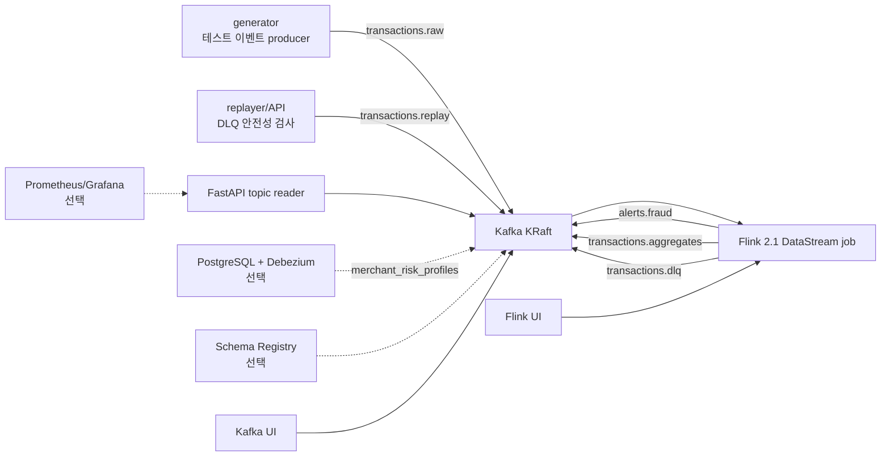

# 프로젝트 구성

이 문서는 이 저장소가 어떤 구성 요소로 이루어져 있고, 각 구성 요소가 스트리밍 파이프라인에서 어떤 책임을 갖는지 설명합니다.

## 한 줄 요약

이 프로젝트는 ML fraud score가 포함된 결제 이벤트를 Kafka KRaft로 수집하고,
Flink 2.1이 event time 기준으로 집계와 알람을 계산하는 학습·검증용 스트리밍 랩입니다.

기본 경로는 Kafka/Flink/DataStream API입니다. Schema Registry, CDC, observability, Flink SQL은 선택 확장으로 제공해 운영 관점과 협업 관점을 함께 학습할 수 있게 했습니다.

## 전체 데이터 흐름


```mermaid
flowchart LR
    Generator["generator<br/>테스트 이벤트 producer"] -->|transactions.raw| Kafka["Kafka KRaft"]
    Replayer["replayer/API<br/>DLQ 안전성 검사"] -->|transactions.replay| Kafka
    Kafka --> Flink["Flink 2.1 DataStream job"]
    Flink -->|alerts.fraud| Kafka
    Flink -->|transactions.aggregates| Kafka
    Flink -->|transactions.dlq| Kafka
    API["FastAPI topic reader"] --> Kafka
    CDC["PostgreSQL + Debezium<br/>선택"] -.->|merchant_risk_profiles| Kafka
    Schema["Schema Registry<br/>선택"] -.-> Kafka
    Metrics["Prometheus/Grafana<br/>선택"] -.-> API
    KafkaUI["Kafka UI"] --> Kafka
    FlinkUI["Flink UI"] --> Flink
```

## 주요 컴포넌트

| 구성 요소 | 경로 | 실행 환경 | 책임 |
| --- | --- | --- | --- |
| Kafka KRaft | `docker-compose.yml`, `k8s/base/kafka*.yaml` | Kafka 4.1.2 | 원천 이벤트, 알람, 집계, DLQ, replay topic 저장 |
| Flink Job | `flink-job/` | Flink 2.1.2, Java 17 | event-time 처리, window 집계, 알람 판단, DLQ 분기 |
| Generator | `generator/` | Python | 실험용 결제 이벤트 생성 |
| Replayer | `replayer/` | Python | 안전성 검사를 통과한 DLQ 이벤트를 replay topic으로 발행하는 CLI tool |
| API | `api/` | FastAPI | Kafka topic 조회, DLQ summary, replay preview/API 실행 |
| Python Common | `common/python/` | Python | API와 replayer가 공유하는 DLQ replay 정책 |
| Schema Registry | `schemas/`, `scripts/register_schemas.py` | Avro, Schema Registry | topic별 schema contract 등록 예제 |
| CDC | `cdc/` | PostgreSQL, Debezium Connect | 가맹점 risk profile 변경을 Kafka topic으로 발행 |
| Observability | `observability/` | Prometheus, Grafana | 보존 레코드 추정치, lag, DLQ, alert 관측 starter |
| Flink SQL | `flink-sql/` | SQL 예제 | DataStream API와 SQL 구현 비교 |
| Docker Compose | `docker-compose.yml`, `Makefile` | Docker | 로컬 학습/검증 실행 환경 |
| Kubernetes | `k8s/` | Strimzi, Flink Operator | operator 기반 배포 참고 매니페스트 |
| Docs | `docs/` | Markdown | 학습, 실행, 운영, 스키마, 버전 결정 문서 |

## Kafka 토픽 구성

| Topic | 생산자 | 소비자 | 목적 |
| --- | --- | --- | --- |
| `transactions.raw` | `generator` | Flink job | 원천 결제/ML fraud 이벤트 |
| `transactions.replay` | `replayer`, API | Flink job | 검증을 통과한 DLQ 재처리 이벤트 |
| `merchant_risk_profiles` | Debezium Connect | Flink job, console consumer | 가맹점 위험 profile CDC 이벤트 |
| `alerts.fraud` | Flink job | API, console consumer | 단건/사용자/가맹점 알람 |
| `transactions.aggregates` | Flink job | API, console consumer | 국가/카테고리/가맹점 1분 집계 |
| `transactions.aggregates.sql` | Flink SQL 예제 | console consumer | SQL 기반 집계 결과 예시 |
| `transactions.dlq` | Flink job | `replayer`, API, console consumer | 파싱 실패, 검증 실패, late event 격리 |

Topic은 `scripts/create-topics.sh`에서 명시적으로 생성합니다. `KAFKA_AUTO_CREATE_TOPICS_ENABLE=false`로 두어 topic 계약이 코드와 운영 스크립트에 드러나도록 했습니다.

## Flink Job 내부 구조

Flink job의 핵심 파일은
`flink-job/src/main/java/io/github/jaejungscene/realtimelab/job/RealTimeAlertJob.java`입니다.

처리 단계:

1. `transactions.raw`와 `transactions.replay`를 함께 읽습니다.
2. Kafka 좌표와 key/value를 `KafkaRecord`로 보존하고 `TransactionParser`에서 JSON parse와 validation을 수행합니다.
3. parse/validation 실패는 side output으로 분리해 `transactions.dlq`로 보냅니다.
4. `merchant_risk_profiles` compacted topic을 earliest부터 읽고 Broadcast State로 유지합니다.
5. transaction의 `merchantId`와 risk profile을 join해 fraud score multiplier와 manual review flag를 반영합니다.
6. enrichment를 마친 정상 이벤트에 `eventTime` watermark를 부여합니다.
7. 고위험 단건 이벤트는 `HIGH_RISK_TRANSACTION` 알람으로 보냅니다.
8. 사용자별 1분 window는 원본 전체가 아닌 누적 통계만 state에 저장하고, burst 조건을 판단해
   `USER_PAYMENT_BURST` 알람을 만듭니다.
9. 국가/카테고리/가맹점 기준 1분 집계를 `transactions.aggregates`로 보냅니다.
10. 가맹점별 1분 window에서 이상 징후를 판단해 `MERCHANT_ANOMALY` 알람을 만듭니다.
11. 허용 지연 시간을 넘긴 late event는 원본 Kafka 좌표와 함께 `transactions.dlq`에 보냅니다.

## Rule 구성

알람 threshold는 직렬화 가능한 `RiskRuleConfig`에 두고, `RiskRules`는 주입받은 설정으로
판단만 수행합니다.

| Rule | 의미 |
| --- | --- |
| `isHighRisk` | 단건 fraud score, amount, IP risk, payment status 기반 알람 |
| `isBurst` | 사용자별 1분 window의 count/amount burst |
| `isMerchantAnomaly` | 가맹점별 1분 window의 거래량/금액/평균 위험도 이상 |

이 구조 덕분에 Flink topology를 크게 바꾸지 않고도 rule test를 추가하거나 threshold를 조정할 수 있습니다.

`merchant_risk_profiles` CDC topic은 Broadcast State로 join됩니다. profile이 없으면 기본 multiplier `1.0`으로 처리하고, profile이 있으면 `risk_multiplier`로 effective fraud score를 계산합니다.

주요 Flink 실행 인자:

| 인자 | 기본값 | 의미 |
| --- | ---: | --- |
| `sourceStartupMode` | `LATEST` | transaction source를 처음 시작할 offset 정책 |
| `sourceIsolationLevel` | `read_uncommitted` | Kafka transaction을 source에서 노출할 범위 |
| `sinkDeliveryGuarantee` | `AT_LEAST_ONCE` | Kafka sink와 checkpoint 전달 보장 |
| `watermarkDelaySeconds` | `10` | 허용하는 out-of-order 범위 |
| `allowedLatenessSeconds` | `30` | window 종료 watermark 이후 추가로 유지할 시간 |
| `sourceIdleTimeoutSeconds` | `30` | 유휴 partition이 watermark를 막지 않게 하는 시간 |
| `maxFutureSkewSeconds` | `300` | 허용 가능한 미래 event time 상한 |
| `transactionalIdPrefix` | `realtime-lab` | exactly-once Kafka transaction namespace |
| `risk*` | `.env.example` 참고 | TaskManager에 전달되는 위험 규칙 임계값 |

`JobConfig`는 알 수 없는 인자, 중복 인자, 잘못된 범위와 topic 이름 충돌을 시작 시점에
거부합니다.

## Docker Compose 구성

| Service | 역할 | 포트/Profile |
| --- | --- | --- |
| `kafka` | single-node broker/controller KRaft | `29092` |
| `topic-init` | topic bootstrap | 일회성 실행 |
| `flink-jobmanager` | Flink JobManager | `8081` |
| `flink-taskmanager` | Flink TaskManager | 내부 통신 |
| `flink-submit` | jar submit 일회성 container | 일회성 실행 |
| `generator` | event producer | `tools` profile |
| `replayer` | DLQ replay producer | `tools` profile |
| `api` | topic reader API | `8000` |
| `kafka-ui` | Kafka browser UI | `8080` |
| `schema-registry` | Avro schema registry | `8085`, `schema` profile |
| `postgres` | CDC source database | `5432`, `cdc` profile |
| `kafka-connect` | Debezium PostgreSQL source connector | `8083`, `cdc` profile |
| `prometheus` | metric scrape | `9090`, `observability` profile |
| `grafana` | starter dashboard | `3000`, `observability` profile |

Compose는 로컬 학습용이므로 Kafka/Flink는 단일 노드입니다. Checkpoint와 savepoint는
named volume에 보존되지만 Docker host 수준의 내구성은 없습니다. 운영 환경에서는
replication, 원격 checkpoint storage, 인증과 네트워크 정책을 별도로 설계해야 합니다.

## Kubernetes 구성

Kubernetes manifests는 Strimzi Kafka Operator와 Flink Kubernetes Operator를 전제로 합니다.

| 경로 | 목적 |
| --- | --- |
| `k8s/base/` | 공통 리소스: Namespace, Kafka, KafkaNodePool, KafkaTopic, FlinkDeployment, API, generator Job |
| `k8s/overlays/dev/` | 로컬/개발 클러스터용 가벼운 실행값 |
| `k8s/overlays/exactly-once/` | Kafka transaction 기반 exactly-once sink 실습 |
| `k8s/overlays/prod-like/` | Kafka node 3개, replicated topic, savepoint upgrade를 비교하는 검토용 설정 |

`prod-like`에는 의도적인 object storage와 image placeholder가 있습니다. S3 filesystem plugin은
Flink image에 포함되어 있으며 인증, TLS, NetworkPolicy를 채우기 전에는 렌더링 비교용으로만
사용합니다.

## 디렉터리별 책임

```text
.
├── api/             # Kafka topic 조회와 DLQ summary/replay API
├── cdc/             # PostgreSQL CDC와 Debezium connector 예제
├── common/          # API와 tool container가 공유하는 Python helper
├── docs/            # 프로젝트 구조, 실행, 시나리오, 운영/학습 문서
├── flink-job/       # Java Flink DataStream job과 unit test
├── flink-sql/       # Flink SQL 집계 예제
├── generator/       # synthetic transaction Kafka producer
├── k8s/             # Strimzi + Flink Operator Kubernetes manifests
├── observability/   # Prometheus/Grafana starter config
├── replayer/        # DLQ -> replay topic 검증/발행 도구
├── schemas/         # Avro schema contract 예제
├── scripts/         # topic 생성, smoke test, 부하/백프레셔 관측 script
├── docker-compose.yml
└── Makefile
```

## 실무 관점에서 볼 포인트

- Raw topic과 replay topic을 분리해 lineage를 보존합니다.
- DLQ summary와 replay API를 분리해 원인 파악, 미리보기, 실행 흐름을 보여줍니다.
- API와 CLI replayer가 같은 replay 허용 정책을 공유해 동작 차이를 줄입니다.
- Kafka envelope를 보존한 뒤 Flink 내부에서 JSON을 해석해 실패 좌표를 DLQ에 남깁니다.
- Event-time, watermark, allowed lateness를 통해 실시간성과 정확성의 tradeoff를 보여줍니다.
- `AT_LEAST_ONCE`와 `EXACTLY_ONCE` 실행 경로를 분리해 checkpoint와 Kafka transaction의 차이를 비교할 수 있습니다.
- 부하 실험에서 lag, 보존 레코드 추정치, Flink vertex 상태를 함께 볼 수 있습니다.
- Rule을 분리해 테스트 가능한 알람 판단 구조를 만듭니다.
- Docker Compose와 Kubernetes 배포를 모두 제공해 학습 환경과 팀 배포 환경의 차이를 비교할 수 있습니다.
- Schema Registry, CDC reference join, observability, chaos 실습을 선택 확장으로 제공해 협업/운영 관점까지 볼 수 있습니다.
